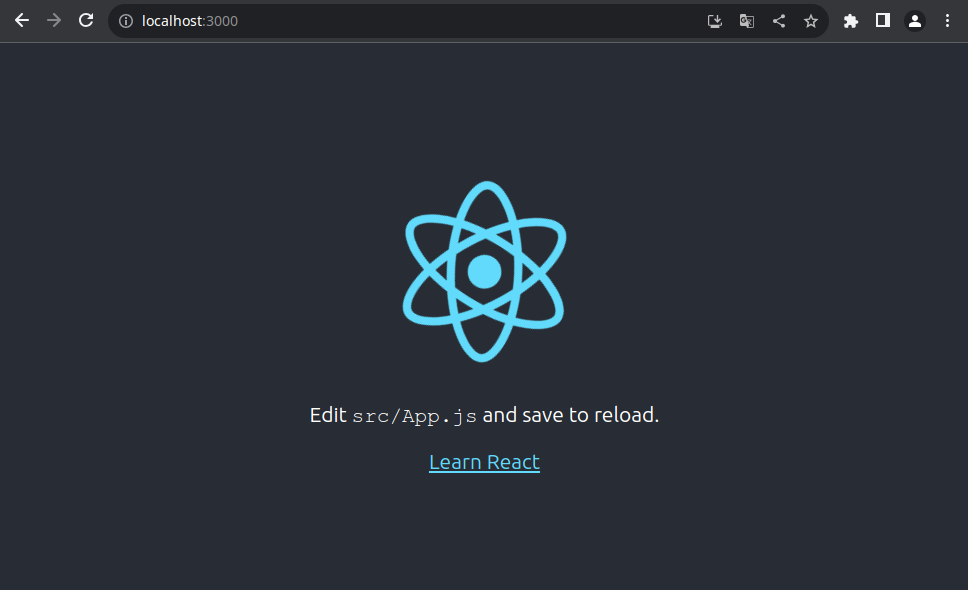
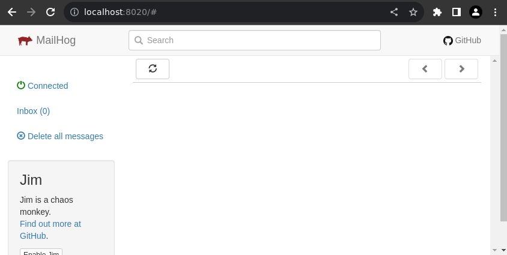
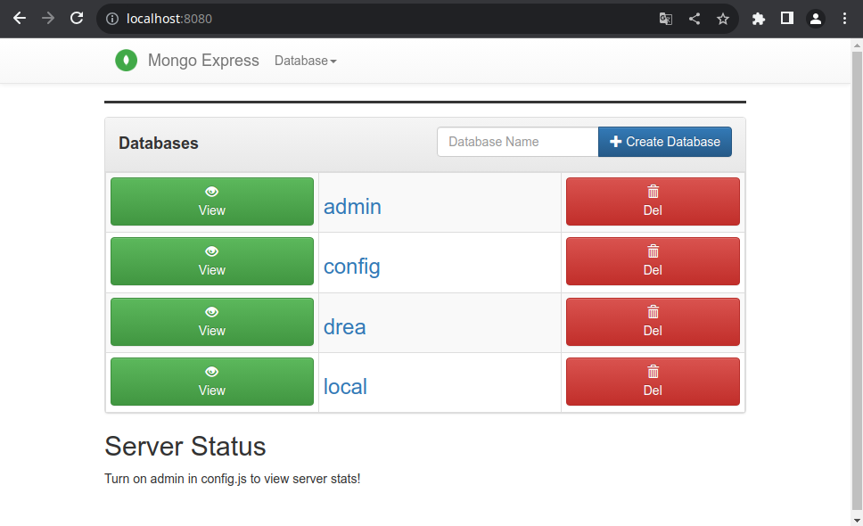
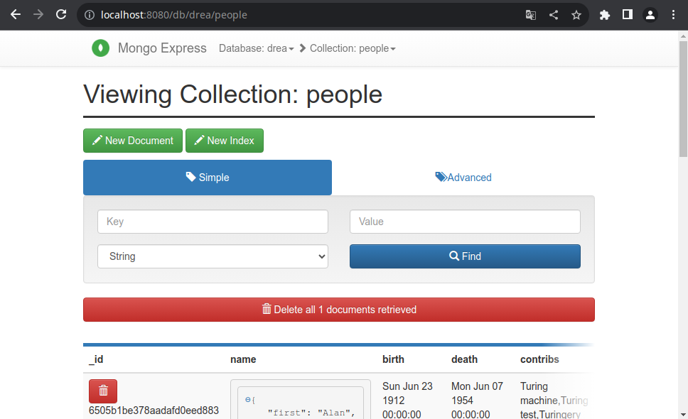
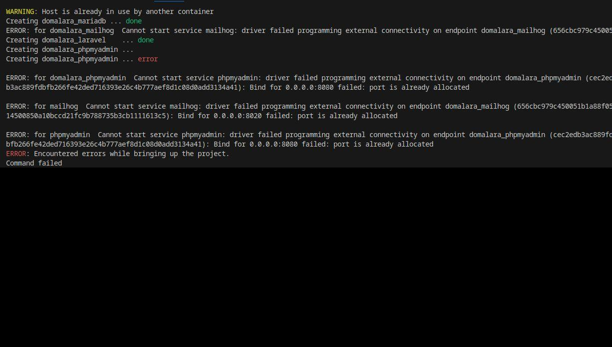

# dreamon (Docker REAct)
Par [pctronique](https://pctronique.fr/) <br />
Version 1.0.0

<details>
  <summary>Table des matières</summary>
  <ol>
    <li>
        <a href="#présentation">Présentation</a>
        <ul>
            <li><a href="#l-avantage-d-utiliser-docker">L'avantage d'utiliser docker</a></li>
            <li><a href="#conteneur-react">Conteneur react</a></li>
            <li><a href="#conteneur-mailhog">Conteneur mailhog</a></li>
            <li><a href="#conteneur-mongo-express">Conteneur mongo-express</a></li>
            <li><a href="#conteneur-mongo">Conteneur mongo</a></li>
            <li><a href="#conteneurs-sgbd">Conteneurs SGBD</a></li>
            <li><a href="#les-fichiers-de-configurations">Les fichiers de configurations</a></li>
        </ul>
    </li>
    <li>
        <a href="#création-du-conteneur-docker">Création du conteneur (Docker)</a>
        <ul>
            <li><a href="#le-fichier-env">Le fichier .env</a></li>
            <li><a href="#les-ports-utilisés-par-docker">Les ports utilisés par docker</a></li>
            <li><a href="#modifier-l-adresse-de-port">Modifier l'adresse de port</a></li>
            <li><a href="#installer-le-conteneur">Installer le conteneur</a></li>
            <li><a href="#modifier-le-fichier-d-intallation">Modifier le fichier d'intallation</a></li>
            <li><a href="#modifier-les-versions">Modifier les versions</a></li>
        </ul>
    </li>
    <li><a href="#rechercher-un-package-docker">Rechercher un package (Docker)</a></li>
    <li>
        <a href="#install-un-package-docker">Install un package (Docker)</a>
        <ul>
            <li><a href="#dans-dockerfile">Dans Dockerfile</a></li>
        </ul>
    </li>
    <li><a href="#logs-et-info-conteneur-docker">Logs et info conteneur (Docker)</a></li>
    <li><a href="#le-dossier-du-projet">Le dossier du projet</a></li>
    <li>
        <a href="#mini-projet-react">Mini projet react</a>
        <ul>
            <li><a href="#les-fichiers-de-configurations-du-projet">Les fichiers de configurations du projet</a></li>
            <li><a href="#packages-installés-dans-le-mini-projet">Packages installés dans le mini-projet</a></li>
        </ul>
    </li>
    <li><a href="#les-commandes-react-dans-le-mini-projet">Les commandes react dans le mini-projet</a></li>
    <li><a href="#visualiser-les-messages-de-la-console-ou-les-logs">Visualiser les messages de la console ou les logs</a></li>
    <li><a href="#server-start-stop-restart">Server start|stop|restart</a></li>
    <li><a href="#en-cas-de-problème-lors-d-installation">En cas de problème lors d'installation</a></li>
  </ol>
</details>

## Présentation
La base docker pour un projet react. Ceci est une base, vous pouvez le modifier selon vos besoins.<br />
> [!WARNING]
> Vous devez installer docker pour pouvoir l'utiliser.

<br />
Vous devez placer votre code dans le dossier "**project/www/**" .
<br /> 

> [!NOTE]
> Le serveur démarre automatique au démarrage du conteneur, vous n'avez normalement pas besoin de le démarrer par vous-même.

### L'avantage d'utiliser docker
Lorsque vos faites un projet avec docker vous devez transmettre la totalité du projet, les fichiers de création des conteneurs et le code. Pour ce projet, vous devez transmettre le contenu en totalité du dossier "**dreamon**" (**que vous pouvez et surtout devez le renommer au nom de votre projet**) dans un git.<br />
Les avantages :<br />
* Pas de programme à installer sur votre pc (à part docker et un éditeur ou IDE)
* Travailler à plusieurs avec les mêmes conteneurs à l'identique
* Prêt à travailler directement sur le code après la création des conteneurs
* Avoir une base prés remplie lors de la création des conteneurs.<sup>(1) [Conteneur mongo](#conteneur-mongo)</sup>
<br /> Après installation des conteneurs, on peut directement continuer le code.

### Conteneur react
Il est conçu à partir de l'image du [docker nodeJS](https://hub.docker.com/_/node/).<br />
Il contiendra vos codes.<br />
Il installe aussi dans le conteneur :<br />
* [react](https://react.dev/)

<br /> 
C'est dans ce conteneur que vous allez placer vos codes angular, dans le dossier "**project**" (qui est lié au conteneur).
<br /><br />

### Conteneur mailhog
Il est conçu à partir de l'image du [docker mailhog](https://hub.docker.com/r/mailhog/mailhog/).<br />
Ce conteneur va vous permettre de visualiser les emails transmis par votre projet nodeJS.
<br /><br />

### Conteneur mongo-express
Il est conçu à partir de l'image du [docker mongo-express](https://hub.docker.com/r/mailhog/mailhog/).<br />
Ce conteneur va vous permettre de visualiser votre base de données mongodb (NOSQL).
<br /><br />

### Conteneur mongo
Il est conçu à partir de l'image du [docker mongo](https://hub.docker.com/_/mongo).<br />
Ce conteneur contiendra votre base de donnée. Il est possible de visualiser son contenu à partir du [conteneur mongo-express](#conteneur-mongo-express)<br />
Il est possible d'entrer des tables lors de sa création, pour se faire il faudra récupérer les tables sous format json et les placer dans un dossier et modifier le fichier "**docker-compose.yml**".<br />
J'ai mis en place un exemple avec la table people "**people.json**" :
```
# start data
- ./.docker/sgbd_data/people.json:/mongo-seed/people.json
# end data
```
<br /><br />

> [!NOTE]
> Vous pouvez changer de SGBD pour un SQL. Pour les projet en nodeJS on utilise principalement un SGBD NOSQL.

### Conteneurs SGBD
Ici je vais présenter quelques conteneurs SGBD et leurs visionneurs sous le format d'un tableau :

| SGBD | visionneur |
| ------------- | ------------- |
| [mariadb](https://hub.docker.com/_/mariadb) | [phpmyadmin](https://hub.docker.com/r/phpmyadmin/phpmyadmin/) |
| [mysql](https://hub.docker.com/_/mysql) | [phpmyadmin](https://hub.docker.com/r/phpmyadmin/phpmyadmin/) |
| [postgres](https://hub.docker.com/_/postgres) | [phppgadmin](https://hub.docker.com/r/dockage/phppgadmin) |
| [mongo](https://hub.docker.com/_/mongo) | [mongo-express](https://hub.docker.com/r/mailhog/mailhog/) |

Ceci est une petite partie des [SGBD](https://fr.wikipedia.org/wiki/Syst%C3%A8me_de_gestion_de_base_de_donn%C3%A9es), vous pouvez vérifier la disponibilité de votre SGBD dans [docker hub](https://hub.docker.com/).

### Les fichiers de configurations
Vous pouvez configurer votre serveur ou le php :
* connection_server.json : dans le dossier ".docker/config/"

> [!WARNING]
> Si vous modifiez les configurations, il faudra redémarrer le conteneur : " [Server start|stop|restart](#server-start-stop-restart) ". <br />
> Vous n'avez pas besoin de le modifier et il doit conserver l'adresse du port du conteneur (pas mettre celui de votre pc).


## Création du conteneur (Docker)
Vous devez avoir installé Docker. 
Pour la création du conteneur docker du projet.

### Le fichier .env
Pour concevoir le projet avec le nom de "**nameProject**" :
```
$ ./bin/name.sh --name=nameProject
```
Ceci va créer le fichier "**.env**" avec le nom du projet pour les conteneurs.

### Les ports utilisés par docker
Vous pouvez visualiser les ports utilisés par docker avec la commande :
```
$ docker container ls
CONTAINER ID   IMAGE                    COMMAND                  CREATED         STATUS         PORTS                                                 NAMES
a0669f134d4e   mongo-express:latest     "tini -- /docker-ent…"   6 seconds ago   Up 3 seconds   0.0.0.0:8080->8081/tcp, :::8080->8081/tcp             donomo_moexpress
f2097a7768ce   donomo_nodjs             "docker-entrypoint.s…"   6 seconds ago   Up 5 seconds   0.0.0.0:3000->3000/tcp, :::3000->3000/tcp             donomo_nodejs
0889ec760f46   mongo:latest             "docker-entrypoint.s…"   6 seconds ago   Up 6 seconds   0.0.0.0:27020->27017/tcp, :::27020->27017/tcp         donomo_mongo
e23b99a411c2   mailhog/mailhog:latest   "MailHog"                6 seconds ago   Up 6 seconds   1025/tcp, 0.0.0.0:8020->8025/tcp, :::8020->8025/tcp   donomo_mailhog
```
Ici, je ne pourrais pas utiliser les ports :::8080, :::3000, :::27020 et :::8020, je devrais utiliser d'autre port. Si mon projet utilise un de ces ports, je devrais incrémenter les ports du projet de mon projet de 1 par exemple, pour 8081, 3001, 27021 et 8021 (si j'ai besoin de ces ports).

<br />

> [!WARNING]
> C'est les ports utilisés par docker sur votre pc, mais ceci ne dis pas si d'autre port son utilisé par votre système.

<br />

Pour visualiser les ports utilisés sur **Linux** :
```
$ ss -natu | grep 0.0.0.0
udp   UNCONN 0      0                                      0.0.0.0:5353                      0.0.0.0:*           
udp   UNCONN 0      0                                      0.0.0.0:34968                     0.0.0.0:*            
tcp   LISTEN 0      4096                                   0.0.0.0:27020                     0.0.0.0:*           
tcp   LISTEN 0      4096                                   0.0.0.0:8080                      0.0.0.0:*          
tcp   LISTEN 0      4096                                   0.0.0.0:8020                      0.0.0.0:*          
tcp   LISTEN 0      4096                                   0.0.0.0:3000                      0.0.0.0:* 
```
Je ne pourrais pas utiliser les ports : 5353, 34968, 27020, 8080, 8020, 3000.

### Modifier l'adresse de port
Si vous avez besoin de modifier le port, merci de le faire dans le fichier "**.env**".<br />
> [!WARNING]
> Ne surtout pas le faire dans le fichier "**.env.example**".

<br />
* .env.example : configuration pour tout le monde qui travaille sur le projet <br /> 
* .env : configuration pour votre pc

<br />Un port de votre pc peut être utilisé par un autre projet, il faudra donc modifier celui-ci. Ce qui est vrai sur un pc, ne le sera pas sur les autres, donc on ne modifit pas les valeurs dans le fichier "**.env.example**".<br />
Il est préférable d'incrémenter à l'identique les ports du projet.<br />
Si je dois incrémenter de 9 un des ports (je conserve la valeur d'incrémentation la plus haute), je le fais aussi pour les autres dans le fichier "**.env**". Ceci évite de se perdre dans les ports disponibles.<br />
Exemple :<br />
```
VALUE_REACT_PORT=3009
VALUE_SGBD_PORT=27029
VALUE_MOEXPRESS_PORT=8089
VALUE_MAILHOG_DISPLAY_PORT=8029
```

### Installer le conteneur
Vous pouvez créer votre conteneur.
```
$ ./install.sh
```

> [!WARNING]
> Ne surtout pas faire la commande '$ docker-compose up --build -d'.

<br />

> [!NOTE]
> Vous devez faire '$ ./install.sh', même après avoir récupéré le projet de votre git.

### Modifier les versions
> [!WARNING]
> Il est indispensable de le faire pour pouvoir utiliser un conteneur identique des années plus tard. Surtout pour le conteneur qui contient le code.

Sur le projet actuel, on utilise les nouvelles versions ce qui peut poser des problèmes sur le projet par la suite. Il est préférable d'utiliser la version utilisée lors de la création du projet.
<br />[docker nodejs](https://hub.docker.com/_/node/)
```
$ ./bin/terminal.sh
# nodejs -v
v20.6.1
# create-react-app --version
5.0.1
```
Dans le fichier "**.docker/react/Dockerfile**", remplacé '**latest**' par la bonne version disponible pour docker :
```
FROM node:latest
```
```
FROM node:20.6.1
```
Pour react dans le même fichier :
```
RUN npm install -g create-react-app
```
```
RUN npm install -g create-react-app@5.0.1
```

<br />

> [!NOTE]
> Vous n'êtes pas obligé de modifier la version des autres conteneurs.

<br />

Pour modifier la version des autres conteneurs, c'est dans le fichier "**.env.example**" :
```
VALUE_SGBD_VERSION=latest
VALUE_MOEXPRESS_VERSION=latest
VALUE_MAILHOG_VERSION=latest
```


## Rechercher un package (Docker)
Si vous avez besoin d'un package pour votre projet dans le conteneur. Vous pouvez rechercher les packages disponibles pour le conteneur.
```
$ ./bin/terminal.sh
# apt-cache search name_package
```

## Install un package (Docker)
Si vous avez besoin d'installer un package dans votre conteneur.
```
$ ./bin/terminal.sh
# apt install name_package
```

### Dans Dockerfile
Quand vous installez un package, vous devez aussi le rajouter dans le fichier "**.docker/react/Dockerfile**", pour le conserver. Avant le "**CMD **".
```
RUN apt install name_package
```

## Logs et info conteneur (Docker)
Vous pouvez avoir besoin de visualiser les logs d'un conteneur si celui-ci ne démarre pas, pour trouver le problème par exemple. Pour ce faire :
```
$ ./bin/container_logs.sh
Options:
   --nodejs
   --mongo
   --mongo-express
   --mailhog
   --helps
   [id ou nom du conteneur]
$ ./bin/container_logs.sh --nodejs
```
Vous pouvez avoir besoin d'information sur l'un des conteneurs, pour trouver sa version par exemple. Pour ce faire :
```
$ ./bin/container_info.sh 
Options:
   --nodejs
   --mongo
   --mongo-express
   --mailhog
   --helps
   [id ou nom du conteneur]
$ ./bin/container_info.sh --mailhog
```
<br />

> [!WARNING]
> Il contient beaucoup d'information sous un format json et ce n'est pas facile de le lire sur le terminal, il est préférable de le mettre dans un fichier json.

<br />
Pour mettre les informations dans un fichier json :
```
$ ./bin/container_info.sh --mailhog >> mailhog_info.json
```

## Le dossier du projet
Votre code devra être placé dans le dossier "**project/www**".

## Mini-projet react
Il y a un mini-projet react pour vous montrer un exemple, mais vous pouvez le retirer en vidant le dossier "**project/www**".<br />
Lors de l'installation, il démarre le serveur react du mini-projet sur '**localhost:3000**' si vous n'avez pas modifié le port (sinon il faut modifier le numéro de port du lien) :
<br /><br />
Vous pouvez modifier le démarrage de votre projet dans le fichier "**.env.example**" et aussi dans le fichier "**.env**" :
```
FOLDER_PROJECT_REACT=www
```

### Packages installés dans le mini-projet
Lors de la création du projet, il y a l'installation de package que vous pouvez retrouver dans le fichier "**./bin/createProject.sh**"
```
docker exec $NAME_REACT_CONTAINER bash -c "cd $FOLDER_PROJECT_REACT/ && npm install nodemailer"
docker exec $NAME_REACT_CONTAINER bash -c "cd $FOLDER_PROJECT_REACT/ && npm install mongodb"
```
> [!NOTE]
> Vous pouvez les retirer si vous en avez pas besoin.

<br />

### Les fichiers de configurations du projet
Vous pouvez configurer celui-ci :
* config_email.json : dans le dossier ".docker/config/"
* connection_mongo.json : dans le dossier ".docker/config/"

> [!WARNING]
> Ne pas modifier les fichiers "**config_sgbd.php**" et "**connection_mongo.php**" du dossier "**project/www/config**" qui sont et resteront vide. 


<br />

## Les commandes nodejs dans le mini-projet
Vous allez avoir besoin de faire des commandes nodejs sur votre code, pour ce faire :
```
$ ./bin/terminal.sh
# cd www/
# npx generate-react-cli component Box
```

## Visualiser les messages de la console ou les logs
Les messages de la console sont transmis dans un fichier et ne sont pas visibles sur le terminal.<br />
* Message sur la console dans le fichier : "**projecttmp/logs/react/react_out.log**".
* Message d'erreur sur la console dans le fichier : "**projecttmp/logs/react/react_error.log**".

## Server start|stop|restart
Vous pouvez avoir besoin de redémarrer votre serveur, il est possible de le faire facilement avec une commande :
```
$ ./bin/server.sh 
Options:
   start
   stop
   restart
   reload
   --helps
$ ./bin/server.sh start
$ ./bin/server.sh stop
$ ./bin/server.sh restart
```

## En cas de problème lors d'installation
Par exemple un problème d'adresse de port, comme l'image ci-dessous :
<br /><br />
Pas de panique, modifier les ports et relancer l'installation.
